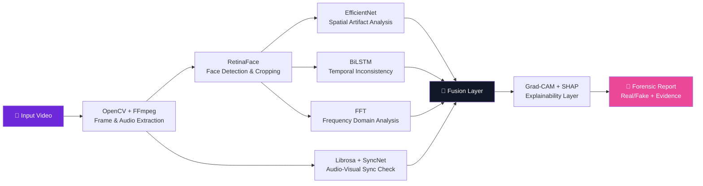
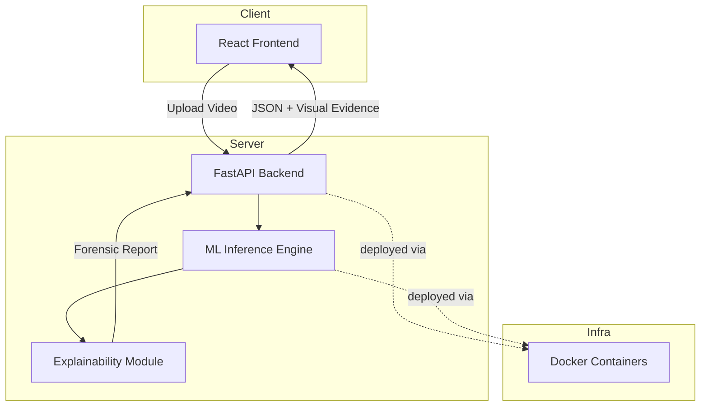

<div align="center">

<!-- Header wave banner -->


<!-- Typing animation -->
<a href="#">
  
</a>

<br/>

<!-- Badges -->


<br/>


<br/>


</div>

<br/>

<!-- Snake animation divider (enable via GitHub Action, see bottom) -->
<div align="center">
  
</div>

---

## 📌 Table of Contents

- [About The Project](#-about-the-project)
- [The Problem](#-the-problem)
- [How It Works](#-how-it-works)
- [Tech Stack](#-tech-stack)
- [System Architecture](#-system-architecture)
- [Project Structure](#-project-structure)
- [Getting Started](#-getting-started)
- [Usage](#-usage)
- [Roadmap](#-roadmap)
- [Team](#-team)
- [Contributing](#-contributing)
- [License](#-license)

---

## 🎯 About The Project


**DeepGuard AI** is an AI/ML-powered, **explainable** system built to detect **face-swap deepfake videos**.

Unlike conventional detectors that only output a binary *Real / Fake* label, DeepGuard AI produces a **complete forensic report** — highlighting manipulated regions, confidence scores, frequency anomalies, and audio-visual mismatches — so digital forensic experts, cybersecurity professionals, and law enforcement agencies can trust *and verify* the result.

> 🏆 Built for **Smart India Hackathon (SIH) 2025** — **Problem Statement SIH 1683**

<br clear="right"/>

## 🚨 The Problem

With the rise of Generative AI, face-swap deepfakes are increasingly weaponized for:

| 🎭 Misinformation | 🕵️ Identity Theft | 💰 Financial Fraud | 🏛️ Political Manipulation | 🔞 Non-Consensual Content |
|:---:|:---:|:---:|:---:|:---:|

As these fakes get more realistic, telling them apart from genuine footage has become a serious challenge — this project exists to close that gap.

---

## ⚙️ How It Works



**Pipeline breakdown:**

1. 🎬 **Preprocessing** — Extract frames & audio using `OpenCV` + `FFmpeg`
2. 🙂 **Face Detection** — Crop precise facial regions with `RetinaFace`
3. 🔬 **Spatial Analysis** — Detect visual manipulation artifacts via `EfficientNet`
4. ⏱️ **Temporal Analysis** — Track frame-to-frame inconsistencies using `BiLSTM`
5. 🌊 **Frequency Analysis** — Uncover hidden GAN fingerprints using `FFT`
6. 🔊 **Audio-Visual Sync** — Verify lip-sync using `Librosa` + `SyncNet`
7. 🧩 **Fusion & Prediction** — Combine all modalities for a final verdict
8. 💡 **Explainability** — Visualize evidence using `Grad-CAM` + `SHAP`

---

## 🛠️ Tech Stack

<div align="center">


</div>

| Category | Technologies |
|---|---|
| **Language** | Python |
| **Computer Vision** | OpenCV, RetinaFace |
| **Deep Learning** | PyTorch, EfficientNet, BiLSTM |
| **Frequency Analysis** | Fast Fourier Transform (FFT) |
| **Audio Processing** | Librosa, SyncNet |
| **Explainable AI** | Grad-CAM, SHAP |
| **Backend** | FastAPI |
| **Frontend** | React |
| **Deployment** | Docker |

---

## 🏗️ System Architecture



---

## 📁 Project Structure

```bash
DeepGuard-AI/
├── 📂 backend/
│   ├── 📂 api/                # FastAPI routes
│   ├── 📂 models/              # PyTorch model definitions
│   ├── 📂 preprocessing/       # OpenCV / FFmpeg / RetinaFace pipeline
│   ├── 📂 explainability/      # Grad-CAM, SHAP modules
│   └── main.py
├── 📂 frontend/
│   ├── 📂 src/
│   └── package.json
├── 📂 dataset/                 # DFDC dataset scripts & loaders
├── 📂 notebooks/                # Colab / Jupyter experiments
├── 📂 docker/
│   ├── Dockerfile.backend
│   └── Dockerfile.frontend
├── docker-compose.yml
├── requirements.txt
└── README.md
```

---

## 🚀 Getting Started

### Prerequisites

```bash
Python 3.9+
Node.js 18+
Docker & Docker Compose
CUDA-enabled GPU (recommended)
```

### Installation

<details>
<summary>📦 Click to expand setup instructions</summary>

```bash
# 1. Clone the repository
git clone https://github.com/your-username/DeepGuard-AI.git
cd DeepGuard-AI

# 2. Set up the backend
cd backend
python -m venv venv
source venv/bin/activate   # On Windows: venv\Scripts\activate
pip install -r requirements.txt

# 3. Set up the frontend
cd ../frontend
npm install

# 4. Run with Docker (recommended)
docker-compose up --build
```

</details>

---

## ▶️ Usage

```bash
# Start backend API
uvicorn main:app --reload --host 0.0.0.0 --port 8000

# Start frontend
cd frontend
npm start
```

Then open **`http://localhost:3000`**, upload a video, and get a full explainable forensic report 🕵️‍♂️

---

## 🗺️ Roadmap

- [x] Project proposal & problem statement finalized
- [x] Dataset pipeline (DFDC) setup in Google Colab
- [ ] Face & audio extraction (MTCNN, moviepy)
- [ ] Spatial model training (EfficientNet)
- [ ] Temporal model training (BiLSTM)
- [ ] Frequency-domain (FFT) module
- [ ] Audio-visual sync module (SyncNet)
- [ ] Explainability layer (Grad-CAM, SHAP)
- [ ] FastAPI backend integration
- [ ] React frontend dashboard
- [ ] Dockerized deployment
- [ ] Final SIH demo 🎉

---

## 👥 Team

<div align="center">


| Role | Name | ID / Enrollment |
| :--- | :--- | :--- |
| **Contributor** | **Rudra Patel** | 24CS074 |
| **Contributor** | **Varshil Patel** | 24CS080 |
| **Contributor** | **Trusha Patel** | 24CS078 |

</div>

---

## 🤝 Contributing

Contributions make the open-source community amazing — any contributions are **greatly appreciated**.

1. Fork the repo
2. Create your feature branch (`git checkout -b feature/AmazingFeature`)
3. Commit your changes (`git commit -m 'Add some AmazingFeature'`)
4. Push to the branch (`git push origin feature/AmazingFeature`)
5. Open a Pull Request

---

## 📜 License

Distributed under the **MIT License**. See `LICENSE` for more information.

---

<div align="center">

### ⭐ If you find this project useful, consider giving it a star!


</div>
